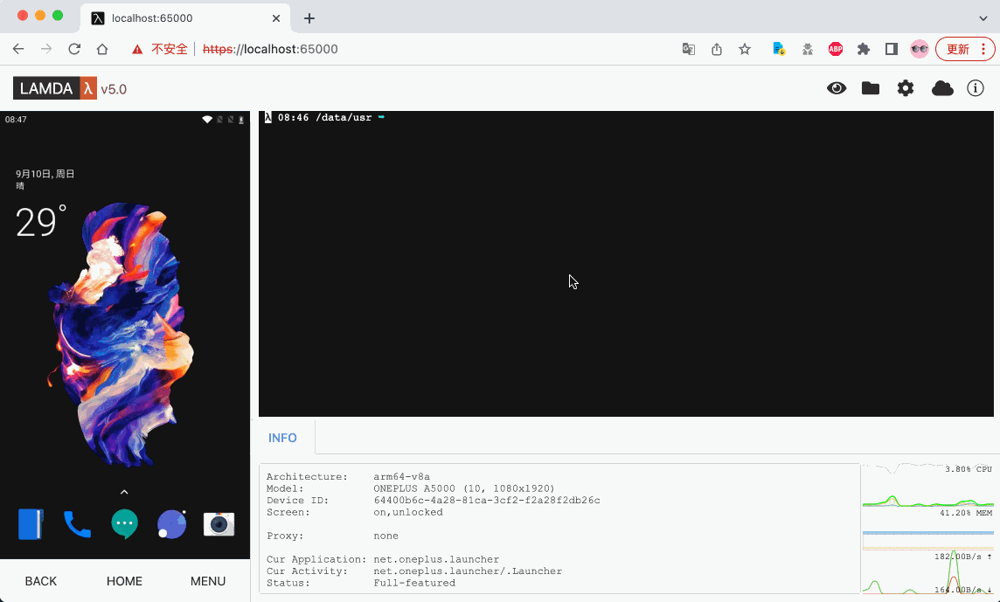

# **FIRERPA Android** ｜ AI-Powered Automation

<h6>An all-in-one next-gen Android automation framework blending robust on-device services with AI-ready agents and extensible tool-calling capabilities.</h6>

<a href="https://device-farm.com/docs/en/">Documentation</a> | <a href="https://device-farm.com/docs/zh/">使用文档</a> | <a href="https://t.me/lamda_dev">TELEGRAM</a> | <a href="https://device-farm.com/llms.txt">llms.txt</a> | <a href="https://device-farm.com/llms-full.txt">llms-full.txt</a>

<h3>Core Capabilities</h3>

FIRERPA is a lightweight, on-device Android automation stack with no external dependencies. It unifies low-latency remote desktop with 160+ APIs for device discovery/status/logs, system and app control, UI automation, OCR/image matching, file I/O, storage, scheduling, and shell execution, plus distributed deployment via Hub/FRP/OpenVPN. Built-in ADB/SSH/SCP, logging, API locking, certificates, script encryption, proxy/VPN/MITM utilities, and reverse tooling (Frida persistence/export/report, IDA debugging, binary patching) round out production workflows, alongside MCP/Agent tool-calls and extensions.

<h3>Deployment & Stability</h3>

FIRERPA delivers stable automation across Android 6.0 to 16, including emulators and cloud phones. Built to run non-intrusively, it requires no complex configuration and supports rooted, long-running services with clean install/upgrade/uninstall flows and repeatable lifecycle control.
<h3>160+ APIs & Python SDK</h3>

FIRERPA offers extensive APIs covering system config, app/process control, UI selectors/gestures, file I/O, encrypted key-value storage, OCR, and image matching. The Python SDK mirrors the full surface and provides higher-level helpers to build reliable automation quickly.

<h3>Remote Desktop & Diagnostics</h3>

Monitor and control devices visually with minimal setup. Includes file upload/download, WebSocket video (MJPEG/H.264), touch streaming, UI inspection, and event monitoring for validation and real-time diagnostics.

---

Our project is not entirely open source to prevent increased countermeasure costs. We remain committed to keeping it free for the community. We guarantee no malicious code; you are welcome to reverse-engineer and analyze its security. See our [Privacy Policy](https://device-farm.com/privacy) or [Contact Us](https://device-farm.com/contact) for enterprise support.
